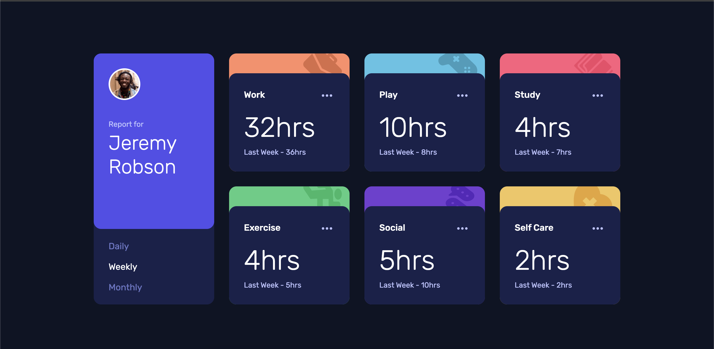

# Time Tracking Dashboard

[](https://app.netlify.com/projects/fefridaytimetrackerapp/deploys)

This is a solution to the [Time tracking dashboard challenge on Frontend Mentor](https://www.frontendmentor.io/challenges/time-tracking-dashboard-UIQ5u5p0N).

- [Time Tracking Dashboard](#time-tracking-dashboard)
  - [Overview](#overview)
    - [The challenge](#the-challenge)
    - [Screenshot](#screenshot)
    - [Features](#features)
    - [Links](#links)
  - [My process](#my-process)
    - [Built With](#built-with)
  - [Getting Started](#getting-started)
    - [Prerequisites](#prerequisites)
    - [Installation](#installation)
    - [Development Server](#development-server)
    - [Build](#build)
    - [Running Tests](#running-tests)
  - [Implementation Details](#implementation-details)
  - [Author](#author)
  - [Acknowledgments](#acknowledgments)


## Overview

The challenge to build out this dashboard and get it looking as close to the design as possible. This project is built with **Angular** using the latest features like **Signals** and **Standalone Components**.

### The challenge

Users should be able to:

- View the optimal layout for the site depending on their device's screen size
- See hover states for all interactive elements on the page
- Switch between viewing Daily, Weekly, and Monthly stats

### Screenshot



### Features

- **Responsive Layout**: Optimized for Mobile (375px) and Desktop (1440px) using CSS Grid.
- **Interactive States**: Hover effects for all interactive elements.
- **Dynamic Timeframes**: Switch between Daily, Weekly, and Monthly stats.
  - "Daily" shows "Yesterday" data.
  - "Weekly" shows "Last Week" data.
  - "Monthly" shows "Last Month" data.
- **Data Driven**: Data is fetched dynamically from a JSON file.

### Links

- Solution URL: [Time Tracking Dashboard](https://github.com/klgh/time-tracking-app)
- Live Site URL: [Time Tracking Dashboard](https://fefridaytimetrackerapp.netlify.app/)

## My process

### Built With

- **Semantic HTML5**
- **CSS Custom Properties** & **Flexbox/Grid**
- **[Angular](https://angular.dev/)** - 21.0.0
- **TypeScript**
- **Signals** - For reactive state management
- **New Control Flow** (`@if`, `@for`)
- **Netlify** - For deployment

## Getting Started

### Prerequisites

Ensure you have Node.js and Yarn installed.

### Installation

Clone the repository and install dependencies:

```bash
git clone https://github.com/klgh/time-tracking-app.git
cd time-tracking-app
yarn install
```

### Development Server

Run the development server:

```bash
yarn start
```
Navigate to `http://localhost:4200/`. The app will automatically reload if you change any of the source files.

### Build

Build the project for production:

```bash
yarn build
```
The build artifacts will be stored in the `dist/` directory.

### Running Tests

Run unit tests via [Vitest](https://vitest.dev/):

```bash
yarn test
```

## Implementation Details

- **`DashboardService`**: A singleton service that fetches the data and holds the `activeTimeframe` as a writable Signal.
- **`ProfileCardComponent`**: Updates the `activeTimeframe` signal on user interaction.
- **`TrackingCardComponent`**: Uses `computed` signals to automatically derive the correct hours and label based on the `activeTimeframe` and the input `activity`.

## Author
- Website - [Kaleigh](https://kaleigh.dev)
- Frontend Mentor - [@klgh](https://www.frontendmentor.io/profile/klgh)

## Acknowledgments
Thank you to Google Antigravity for the assistance with the Angular documentation for the Signals and Standalone Components.